# Resumen

Los humedales de la Orinoquía colombiana presentan una dinámica hídrica fuertemente estacional, pero su monitoreo mediante percepción remota sigue limitado por la nubosidad, la heterogeneidad de coberturas y la escasez de metodologías replicables para series multianuales. Este trabajo analiza la dinámica de inundación estacional en la cuenca del río Bita durante el periodo 2017-2021, mediante imágenes Sentinel-1 SAR, procesamiento en Google Earth Engine e integración con JRC Global Surface Water. Para ello, se construyeron composiciones estacionales de retrodispersión en VV y VH, se calcularon ratios seco-húmedo en escala lineal y se seleccionó una combinación de umbrales R_VV = 1.5 y R_VH = 1.3 mediante análisis de sensibilidad. Los productos derivados mostraron diferencias claras entre polarizaciones y operadores lógicos: OR amplió la detección al incorporar respuestas individuales, mientras que AND produjo una delimitación más conservadora. La integración con JRC Global Surface Water permitió complementar la señal estacional detectada por SAR con cuerpos de agua permanentes, que no siempre presentan contraste radiométrico entre temporadas. Los resultados evidencian una variabilidad interanual marcada, con mayor extensión de inundación en 2018 y una reducción notable en 2020. La validación del producto final alcanzó una exactitud global de 0.8867, F1-score de 0.8759 y exhaustividad de 0.9677, lo que indica baja omisión de áreas inundadas, aunque con cierta comisión asociada a respuestas SAR ambiguas.

**Palabras clave:** humedales; Orinoquía; Sentinel-1 SAR; retrodispersión; detección de cambios; inundación estacional; Google Earth Engine; JRC Global Surface Water; cartografía multitemporal.

# Introducción y justificación

Los humedales, como otros ecosistemas fundamentales en el planeta, ofrecen servicios de diversos tipos, desde los relacionados al aprovisionamiento de agua y comida, la regulación climática y de calidad de aire, hasta servicios culturales [@Robertson2025]. Considerando estas características fue creada la Convención de Ramsar: un tratado intergubernamental que propende por la conservación y gestión sostenible de estas zonas de humedales, que, por su importancia dentro de las diferentes esferas socioambientales, merecen un cuidado especial [@Ramsar2016]. En Colombia se han designado once áreas de humedales que cubren desde el nivel del mar hasta la alta montaña [@JaramilloEstupinan2017; @MinambienteSF]. Es el caso del complejo de humedales de la cuenca del río Bita, en el departamento del Vichada, que fue incluido dentro de esta lista por el Decreto 1076 de 2015, en el que se reconoce el carácter estratégico de este ecosistema. Es así que adquirir datos vía percepción remota ha sido la herramienta más útil para llevar un seguimiento del comportamiento de las diferentes dinámicas ambientales propias de los humedales y la diversidad que en ellos alberga frente a las presiones antrópicas y las afectaciones del cambio climático [@Guo2017].

Los datos de radares de apertura sintética (SAR) han sido especialmente útiles para capturar las características de los humedales [@Yuan2025]. Estos ecosistemas presentan una estructura tridimensional compleja, determinada por la presencia variable de agua superficial, vegetación sumergida, flotante y emergente, junto a gradientes de humedad que cambian estacionalmente [@Hubinger2026; @Robertson2025]. Así, los sensores de radar de apertura sintética ofrecen ventajas para el mapeo de inundación y humedales, ya que registran la energía retrodispersada por la superficie y son sensibles a la estructura de la vegetación [@Adeli2020].

Estudios recientes han mostrado el potencial de Sentinel-1 SAR para caracterizar la dinámica de inundación en humedales estacionales y tropicales. Un antecedente particularmente cercano es el trabajo de @JeanMilien2026 en el Pantanal brasileño, donde imágenes Sentinel-1 GRD fueron utilizadas para mapear y monitorear la inundación en un humedal tropical de sabana entre 2017 y 2020. Pese a que ambas áreas de estudio son distintas en sus características biogeofísicas, representa un trabajo paralelo que expone métodos interesantes como el método de segmentación Otsu. Por otro lado, @Tsyganskaya2019a muestran que el agua abierta y la vegetación inundada pueden producir respuestas de retrodispersión opuestas, con disminuciones asociadas a superficies especulares e incrementos asociados a doble rebote en vegetación inundada. En la misma línea, @McCormack2023 evidencian que las secuencias multitemporales Sentinel-1 pueden servir como aproximación a la dinámica hidrológica de humedales estacionales, mientras que @Tupas2023b advierten que los mapas de inundación basados solo en SAR pueden ser ambiguos en zonas de baja retrodispersión, sombra radar o vegetación densa.

A nivel nacional se posee un trabajo sobresaliente sobre la clasificación y ubicación de humedales, gestionada por el Instituto Alexander von Humboldt [@JaramilloVilla2015], que, por más de diez años, estableció la información estándar de las cartografías oficiales de humedales y los lineamientos para clasificar la gran variedad de humedales que el país posee. Dicho trabajo incorpora diversas investigaciones que representan un robusto cuerpo del arte para la segunda mitad de la década pasada [@Florez2016; @Quinones2016; @Ricaurte2019; @TrujilloLasso2017]. Sin embargo, posterior a dicha investigación, los estudios que abordaron específicamente la Orinoquía no son caracterizados por metodologías de fotointerpretación y digitalización manual debido a su diversidad biogeofísica [@TrujilloLasso2017]. En medio de este panorama, vale la pena mencionar una reciente investigación realizada por @Nino2026, quienes utilizan percepción remota para el mapeo de pasturas en la Orinoquía. Es así que se reconoce la necesidad de nuevas propuestas que conduzcan hacia facilidades metodológicas para la replicabilidad y la accesibilidad del levantamiento y análisis de datos.

Desde una perspectiva geomática, este problema implica representar y analizar un fenómeno natural mediante datos espaciales, procesamiento satelital, integración de fuentes raster, análisis multitemporal, generación cartográfica y validación temática. Así pues, en el presente informe se plantea explorar el procesamiento de datos SAR, debido a que su capacidad de penetrar nubes e interactuar con la vegetación y superficies de agua abierta los hacen deseables para el mapeo de inundaciones asociadas a ecosistemas de humedal [@Adeli2020]. De manera que la pregunta que se abordará es: ¿cómo pueden los cambios estacionales de retrodispersión Sentinel-1 SAR contribuir al mapeo de la dinámica de inundación estacional en la cuenca del río Bita?

# Objetivos

## Objetivo general

Analizar la dinámica multianual de inundación estacional en la cuenca del río Bita durante el periodo 2017-2021 mediante el procesamiento de imágenes Sentinel-1 SAR, la integración de JRC Global Surface Water y el uso de herramientas de análisis espacial en Google Earth Engine.

## Objetivos específicos

1. Construir composiciones estacionales de retrodispersión Sentinel-1 SAR para representar condiciones secas y húmedas en la cuenca del río Bita durante el periodo 2017-2021.

2. Calcular métricas de cambio seco-húmedo en las polarizaciones VV y VH, evaluar combinaciones de umbrales y comparar operadores lógicos para la detección de inundación estacional.

3. Integrar el producto estacional derivado de Sentinel-1 SAR con información de agua permanente de JRC Global Surface Water para generar cartografía anual y multianual de la dinámica hídrica.

4. Evaluar el desempeño temático del producto final mediante puntos de control y métricas de exactitud, precisión, exhaustividad y F1-score.

# Área de estudio

La cuenca del río Bita se ubica en el departamento del Vichada, dentro de la región hidrográfica de la Orinoquía colombiana, que cuenta 14.725.346 ha de humedal, convirtiéndola en la región con más humedales en el país. De esta área, 812.312 ha pertenecen a la cuenca objeto de la presente investigación [@JaramilloVilla2015]. De tal forma, la zona hidrográfica del río contiene casi un 25% del total de la variedad de humedales en la Orinoquía [@Lasso2014], lo cual permite entender por qué pertenece a la categoría de protección y conservación Ramsar. Siendo aportante directo del Orinoco, su dinámica obedece a los regímenes estacionales característicos de esta zona del país [@TrujilloLasso2017].

```{r}
#| label: fig-localizacion
#| fig-cap: "Localización del área de estudio. Cuenca del río Bita, Orinoquía colombiana."
#| echo: false
#| out-width: "100%"
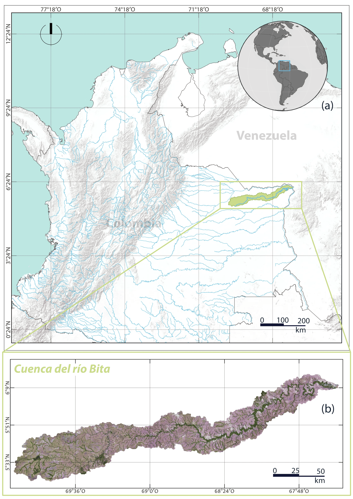
```

# Fuentes de datos

Este estudio utilizó imágenes Sentinel-1 SAR Ground Range Detected (GRD) para analizar la dinámica hídrica multianual en la cuenca del río Bita durante el periodo 2017-2021. Se emplearon escenas en banda C, modo Interferometric Wide Swath (IW), con polarizaciones VV y VH, procesadas en Google Earth Engine. La selección de imágenes se restringió a una misma geometría orbital para reducir diferencias radiométricas asociadas al ángulo de observación y permitir comparaciones temporales consistentes entre temporadas. Esta decisión sigue criterios habituales en enfoques de detección de cambios SAR, donde las imágenes comparadas deben provenir del mismo sensor, órbita, polarización y cobertura espacial [@Li2018]. La colección Sentinel-1 GRD disponible en Google Earth Engine corresponde a un producto calibrado y ortocorregido generado a partir de Sentinel-1 Toolbox, disponible en escala logarítmica asociada al coeficiente de retrodispersión [@GoogleEarthEngine2026; @Mullissa2021].

Para cada año se construyeron composiciones representativas de temporada seca y temporada húmeda. A partir de las composiciones se derivaron métricas de cambio en VV y VH, incluidas diferencias de retrodispersión y ratios seco-húmedo [@AlMehedi2025; @Tsyganskaya2019b]. La literatura previa sobre Sentinel-1 en áreas inundadas vegetadas muestra que las series temporales y las combinaciones entre polarizaciones permiten distinguir respuestas asociadas con agua abierta temporal, vegetación inundada y superficies no inundadas, aunque es recomendable acompañarlas de información auxiliar para mejorar dicha clasificación [@Bangira2021; @Tupas2023b].

Como fuente complementaria se utilizó JRC Global Surface Water para incorporar información histórica de agua superficial permanente o recurrente [@Pekel2016]. Esta capa permitió diferenciar áreas con presencia de agua persistente de aquellas que presentan cambios estacionales de retrodispersión. El uso de información auxiliar de agua permanente también se encuentra en flujos recientes de mapeo de inundación con Sentinel-1 en Google Earth Engine, donde se emplea para excluir o controlar cuerpos de agua permanentes antes de interpretar cambios asociados a eventos o periodos de inundación [@AlMehedi2025].

```{r}
#| label: tbl-fuentes-datos
#| tbl-cap: "Fuentes de datos utilizadas para la detección multianual de inundación estacional en la cuenca del río Bita."
#| echo: false
library(knitr)

datos <- data.frame(
  Fuente = c(
    "Sentinel-1 SAR GRD",
    "JRC Global Surface Water",
    "Límite de la cuenca del río Bita",
    "Puntos de validación",
    "Google Earth Engine"
  ),
  Tipo = c(
    "Raster SAR",
    "Raster de agua superficial",
    "Vector poligonal",
    "Vector puntual",
    "Plataforma de procesamiento geoespacial"
  ),
  Resolucion_Escala = c(
    "10 m",
    "30 m",
    "Escala de cuenca",
    "300 puntos",
    "No aplica"
  ),
  Periodo = c(
    "2017-2021",
    "Serie histórica / producto anual",
    "Estático",
    "2018, 2020 y 2021",
    "Procesamiento en la nube"
  ),
  Uso = c(
    "Construcción de composiciones estacionales, cálculo de ratios y detección de cambio",
    "Representación del componente de agua permanente o recurrente",
    "Delimitación del área de estudio, recorte de imágenes y cálculo de áreas",
    "Evaluación temática del producto final",
    "Filtrado, composición, clasificación, integración de capas, exportación y cálculo de estadísticas"
  )
)

kable(datos)
```

```{r}
#| label: tbl-sentinel
#| tbl-cap: "Características técnicas de las imágenes Sentinel-1 GRD utilizadas para la cartografía de aguas superficiales."
#| echo: false
sentinel <- data.frame(
  Caracteristica = c(
    "Sensor",
    "Producto",
    "Banda",
    "Modo de adquisición",
    "Sentido de órbita",
    "Frecuencia central",
    "Longitud de onda",
    "Resolución espacial",
    "Anchura de barrido",
    "Polarizaciones"
  ),
  Valor = c(
    "Sentinel-1",
    "Ground Range Detected (GRD)",
    "C",
    "Interferometric Wide Swath (IW)",
    "Ascendente",
    "5.405 GHz",
    "5.6 cm",
    "10 m",
    "250 km",
    "VV y VH"
  )
)

kable(sentinel)
```

# Metodología

El procesamiento se desarrolló en Google Earth Engine a partir de imágenes Sentinel-1 SAR Ground Range Detected (GRD) para el periodo 2017-2021. Se emplearon escenas en banda C, modo Interferometric Wide Swath (IW), con polarizaciones VV y VH. Antes de construir los productos de cambio, se evaluó la disponibilidad anual de imágenes por temporada y por geometría orbital, diferenciando adquisiciones ascendentes y descendentes. Esta revisión permitió seleccionar una geometría de observación consistente para el análisis multianual, redujo diferencias radiométricas asociadas al ángulo de adquisición y evitó mezclar trayectorias orbitales en las comparaciones seco-húmedo. Esta decisión sigue criterios habituales de detección de cambios SAR, donde las imágenes comparadas deben provenir del mismo sensor, órbita, polarización y cobertura espacial [@Li2018].

```{r}
#| label: fig-disponibilidad-s1
#| fig-cap: "Distribución anual de escenas Sentinel-1 disponibles para la cuenca del río Bita durante las temporadas seca y húmeda, separadas por órbita ascendente y descendente."
#| echo: false
#| out-width: "100%"
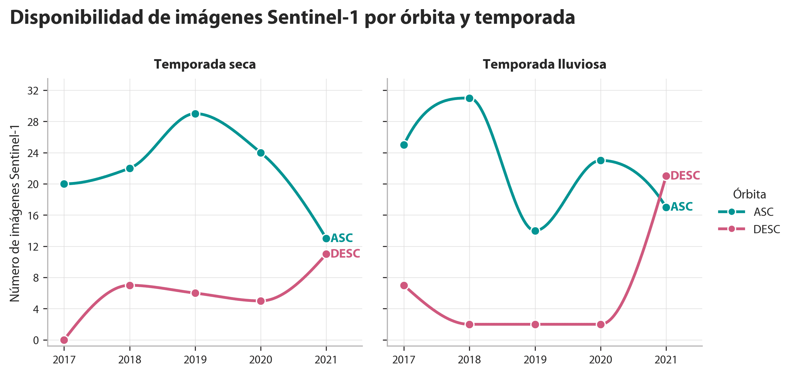
```

El primer momento del procedimiento consistió en construir composiciones estacionales de retrodispersión para cada año del periodo de análisis. Para ello, la colección Sentinel-1 fue filtrada según el área de estudio, el rango temporal, la órbita seleccionada, el modo IW y las polarizaciones VV y VH. Posteriormente, las imágenes disponibles se agruparon en dos ventanas estacionales: temporada seca y temporada húmeda (enero a marzo y julio a septiembre, respectivamente). Para cada año y cada temporada se generaron composiciones separadas de VV y VH mediante mediana, con el fin de representar condiciones hidrológicas contrastantes y reducir la dependencia de imágenes individuales afectadas por speckle, variabilidad puntual o condiciones locales de adquisición [@Tsyganskaya2019b].

La comparación entre temporada seca y húmeda fue planteada como una adaptación estacional de los métodos de detección de cambios SAR. En la literatura, estos métodos comparan una imagen de referencia no inundada con una imagen objetivo afectada por inundación mediante operadores como diferencias, ratios o ratios logarítmicos. @Li2018 señalan que el operador ratio o log-ratio es utilizado con frecuencia como indicador de cambio en imágenes SAR, debido a la naturaleza multiplicativa del speckle y a la utilidad de comparar condiciones radiométricas contrastantes. En el presente trabajo, la composición seca cumplió el papel de condición de referencia y la composición húmeda representó la condición de respuesta hidrológica estacional.

Para este fin, los valores de retrodispersión expresados en decibelios fueron transformados a escala lineal mediante:

$$
\sigma^0_{\text{lineal}} = 10^{\frac{\sigma^0_{\text{dB}}}{10}}
$$

Esta conversión fue necesaria porque el dB corresponde a una transformación logarítmica de la potencia retrodispersada. Por tanto, dividir directamente valores en dB no produce un cociente físico de retrodispersión. Es así que se calcularon ratios dry/wet para VV y VH:

$$
R_{VV} = \frac{VV_{\text{dry}}}{VV_{\text{wet}}}
$$

$$
R_{VH} = \frac{VH_{\text{dry}}}{VH_{\text{wet}}}
$$

Dichas ratios dry/wet fueron interpretadas como indicadores relativos de reducción de retrodispersión durante la temporada húmeda [@EODC2024; @UNSpider2024]. Valores mayores que 1 indican que la señal fue más alta en seco que en húmedo. Cuanto mayor es la ratio, mayor es la disminución relativa de retrodispersión durante la temporada húmeda [@Tupas2023a]. Este procedimiento es comparable con el trabajo de detección de inundación de @AlMehedi2025, en el que calculan una imagen de división entre un periodo seco y un periodo inundado y aplican umbrales sobre el resultado para identificar áreas afectadas por inundación.

Una vez generadas las métricas de cambio, se evaluaron distintas combinaciones de umbrales para las ratios R_VV y R_VH. El objetivo fue observar la sensibilidad del área detectada ante umbrales más permisivos o más restrictivos. Para ello, se calcularon productos binarios de inundado/no inundado y se estimó el área media detectada para el periodo 2017-2021. Esta prueba permitió seleccionar una combinación intermedia, evitó umbrales demasiado bajos, que expanden la detección hacia áreas de menor contraste radiométrico, y umbrales demasiado altos, que restringen el producto a sectores con cambios más marcados.

```{r}
#| label: fig-sensibilidad-umbrales
#| fig-cap: "Sensibilidad del área estacional ante combinaciones de umbrales R_VV y R_VH. Área media detectada para distintas combinaciones de umbrales aplicadas a las ratios seco-húmedo de VV y VH. La línea punteada indica la combinación seleccionada para el producto final."
#| echo: false
#| out-width: "85%"
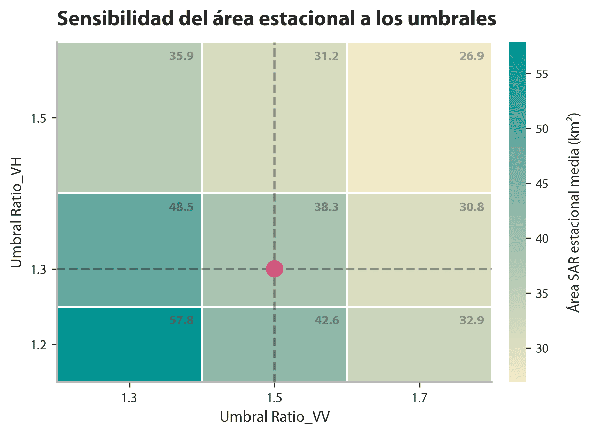
```

De forma complementaria, se evaluó la estabilidad interanual de las combinaciones de umbrales. Para cada par R_VV/R_VH se calculó el área media detectada entre 2017 y 2021 y el rango mínimo-máximo observado entre años. Esta comparación permitió reconocer combinaciones con detecciones muy amplias, detecciones más conservadoras y diferencias en la variabilidad anual del área clasificada.

```{r}
#| label: fig-resumen-umbrales
#| fig-cap: "Relación de las combinaciones de umbrales R_VV/R_VH. El punto representa el área media detectada entre 2017 y 2021, mientras que la línea horizontal muestra el rango mínimo-máximo observado entre años para cada combinación de umbrales. El rectángulo encierra la combinación de umbrales de ratio elegida."
#| echo: false
#| out-width: "85%"
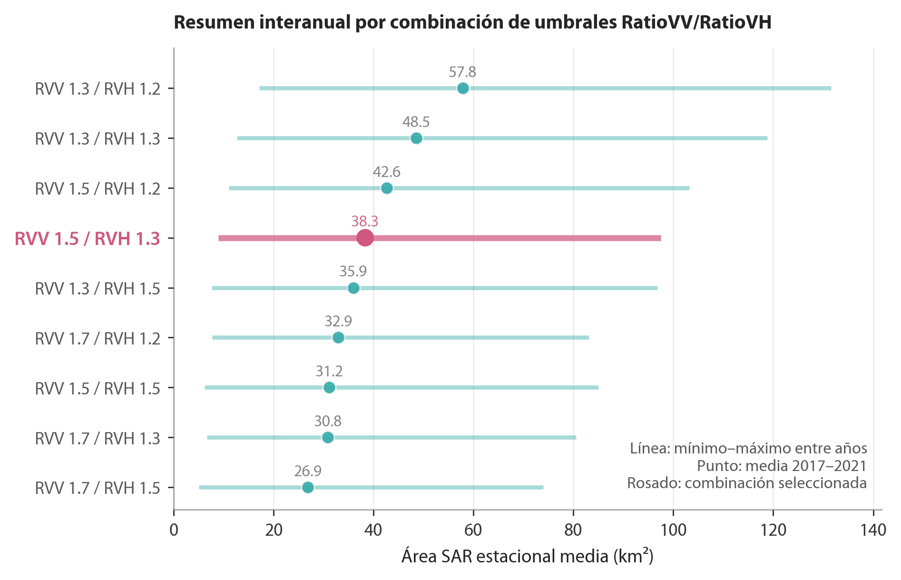
```

A partir de los umbrales seleccionados, R_VV = 1.5 y R_VH = 1.3, se generaron productos anuales de cambio estacional para el periodo 2017-2021. Para cada año se obtuvieron capas de ratio R_VV y R_VH, y combinaciones lógicas entre polarizaciones. La operación AND identificó los píxeles donde el criterio de cambio se cumplió simultáneamente en R_VV y R_VH, por lo que resultó en un producto más restrictivo. La operación OR identificó los píxeles donde el criterio se cumplió en al menos una de las dos ratios.

$$
AND = (R_{VV} \geq 1.5) \cap (R_{VH} \geq 1.3)
$$

$$
OR = (R_{VV} \geq 1.5) \cup (R_{VH} \geq 1.3)
$$

La separación entre R_VV y R_VH respondió a su sensibilidad física distinta. VV fue analizada por su relación con mecanismos de doble rebote y con cambios en la interacción entre agua y estructuras verticales, mientras que VH fue considerada por su relación con dispersión volumétrica, estructura de la vegetación y pérdida de señal en condiciones de agua abierta [@Tsyganskaya2019b]. Estudios en planicies inundables vegetadas con Sentinel-1 han mostrado que las trayectorias temporales de VV, VH y sus relaciones pueden diferenciar agua abierta, vegetación baja inundada y vegetación emergente, aunque la respuesta depende del tipo de cobertura y de las condiciones ambientales [@Bangira2021].

De forma complementaria, se incorporó la capa JRC Global Surface Water para representar agua superficial permanente [@Pekel2016]. Lo anterior responde a una limitación del enfoque del presente trabajo, pues los cuerpos de agua permanentes pueden no mostrar un contraste fuerte entre temporadas y, por tanto, no terminan siendo contados como inundación en productos basados exclusivamente en cambio. Flujos recientes de mapeo de inundación con Sentinel-1 en Google Earth Engine también emplean información de agua permanente para controlar o excluir cuerpos de agua antes de interpretar cambios asociados a inundación [@AlMehedi2025].

Finalmente, los productos anuales fueron sintetizados en una capa multianual para analizar la recurrencia espacial de la respuesta hídrica entre 2017 y 2021. Para cada métrica y combinación se calculó la frecuencia de detección a lo largo del periodo, expresada como el número de años en que un píxel fue identificado como compatible con inundación estacional o cambio hídrico. También se estimó el área detectada en kilómetros cuadrados por año, producto y polarización, con el fin de comparar la magnitud espacial de la respuesta entre las diferentes formulaciones.

```{r}
#| label: fig-flujo-metodologico
#| fig-cap: "Flujo metodológico seguido para la detección de agua estacional, permanente y total en la cuenca del río Bita."
#| echo: false
#| out-width: "95%"
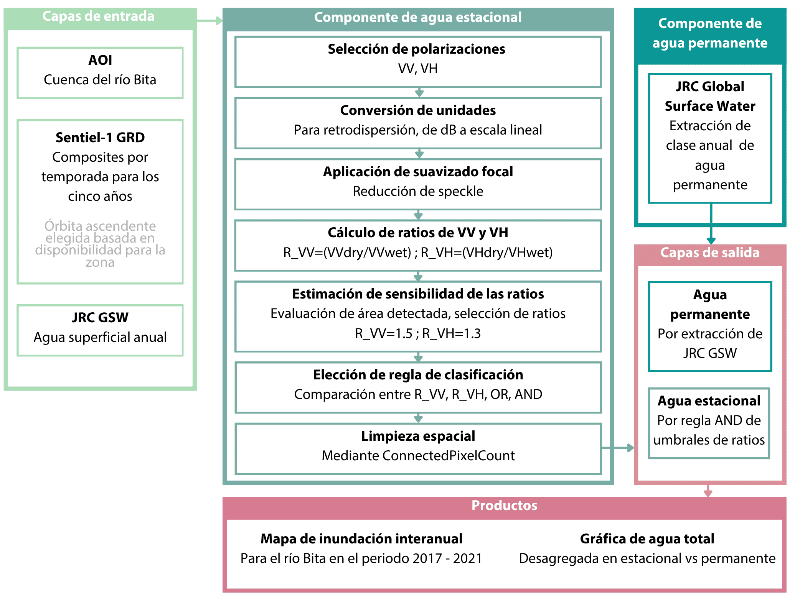
```

# Resultados y discusión

Los productos derivados de las operaciones R_VV, R_VH, AND y OR mostraron diferencias notorias en la extensión detectada. La operación OR produjo las áreas más amplias, al incorporar los píxeles detectados por cualquiera de las dos ratios de polarización. En contraste, AND generó el producto más restrictivo, al conservar únicamente los píxeles donde la condición de cambio se cumplió de forma simultánea en VV y VH. Entre las polarizaciones individuales, R_VH detectó más área que R_VV durante todo el periodo, lo que indica que ambas bandas no capturaron la misma respuesta estacional de la superficie.

```{r}
#| label: fig-comparacion-operadores
#| fig-cap: "Comparativa del área de agua estacional detectada para 2021. Las secciones corresponden respectivamente a OR, R_VH, R_VV y AND."
#| echo: false
#| out-width: "100%"
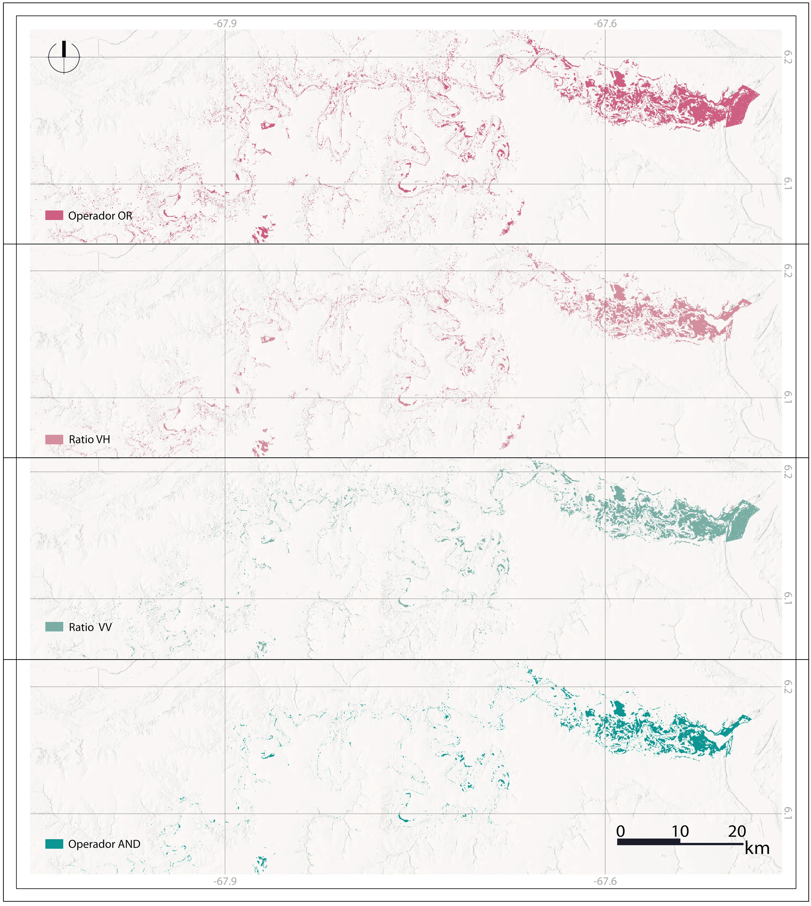
```

Por su parte, la serie anual mostró una mayor extensión detectada en 2017 y 2018, seguida por una reducción marcada desde 2019. El año 2018 concentró los valores máximos en todos los productos, mientras que 2020 presentó las áreas más bajas en la mayoría de las operaciones. En 2021 se observó una recuperación parcial, especialmente en R_VV y AND, aunque sin alcanzar los valores registrados al inicio del periodo. Este comportamiento sugiere una variabilidad interanual en la respuesta seco-húmedo, más evidente en los productos inclusivos que en los restrictivos.

```{r}
#| label: fig-area-operadores
#| fig-cap: "Área estacional detectada según operación a través del periodo 2017-2021."
#| echo: false
#| out-width: "90%"
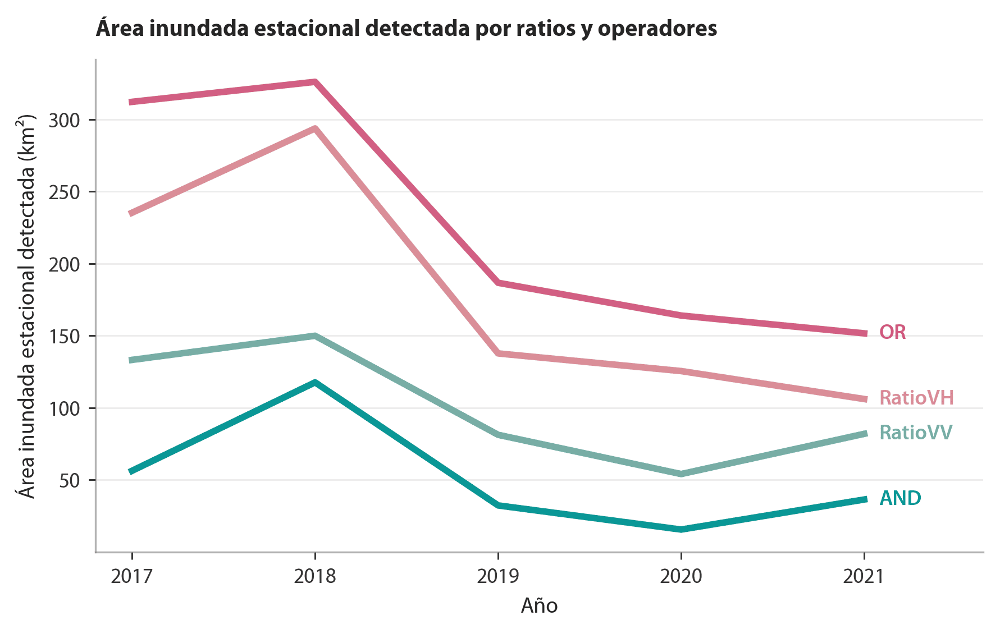
```

Con base en las figuras anteriores, se evidencia por qué AND fue seleccionado como aproximación de la inundación estacional detectada por SAR. Esta operación conservadora redujo la inclusión de píxeles asociados con respuestas aisladas de una sola polarización y privilegió las áreas donde el cambio de retrodispersión fue consistente entre VV y VH.

En el proceso metodológico, le siguió la integración con JRC Global Surface Water, que permitió complementar el producto de señal de inundación detectada con radar con una base de agua permanente. En este procedimiento, el componente de radar aportó la señal de cambio estacional, mientras que JRC permitió incorporar cuerpos de agua permanentes que pueden no presentar contraste fuerte entre temporada seca y húmeda. Esta integración evitó que los cuerpos de agua permanentes quedaran subrepresentados bajo la metodología de detección por cambio de temporada.

```{r}
#| label: fig-integracion-jrc-sar-2018
#| fig-cap: "Proceso de construcción del área anual integrada entre agua permanente JRC y componente radar estacional para el año 2018. Año con máxima extensión de agua registrada."
#| echo: false
#| out-width: "100%"
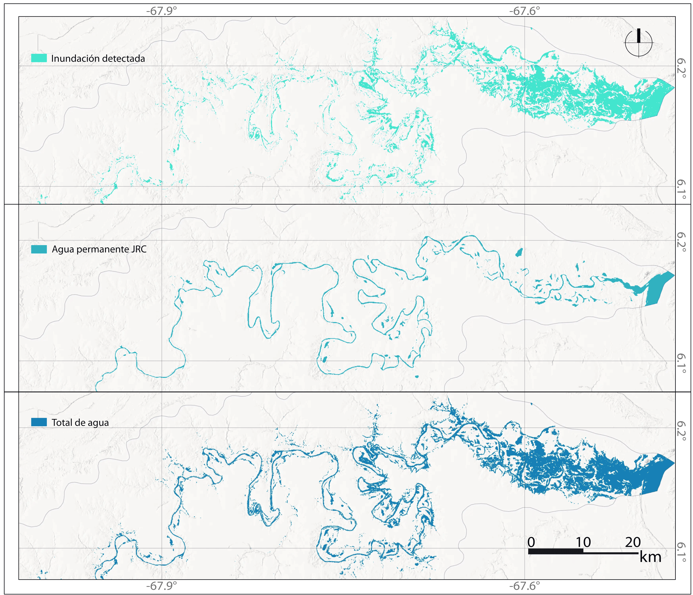
```

```{r}
#| label: fig-integracion-jrc-sar-2020
#| fig-cap: "Proceso de construcción del área anual integrada entre agua permanente JRC y componente radar estacional para el año 2020. Año con mínima extensión de agua registrada."
#| echo: false
#| out-width: "100%"
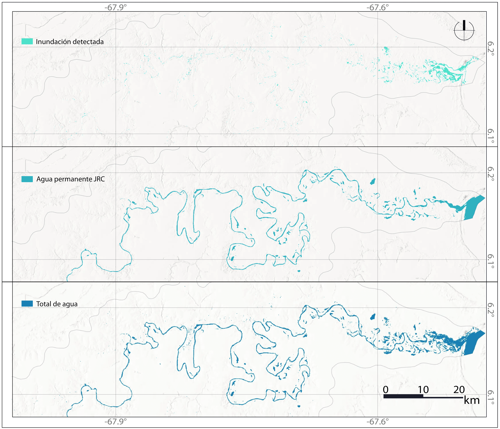
```

Asimismo, la suma multianual permitió identificar áreas con recurrencia de señal compatible con inundación estacional durante el periodo 2017-2021. Las zonas detectadas en varios años representaron sectores donde el contraste seco-húmedo estuvo presente a través de las temporadas. Es pertinente precisar que esta lectura no equivale, per se, a permanencia de agua; más bien, equivale a la repetición de una respuesta en el radar asociada con cambios estacionales de retrodispersión.

```{r}
#| label: fig-mapa-multianual
#| fig-cap: "Mapa de inundación estacional multianual detectada con Sentinel-1 SAR y JRC Global Surface Water para el periodo 2017-2021."
#| echo: false
#| out-width: "100%"
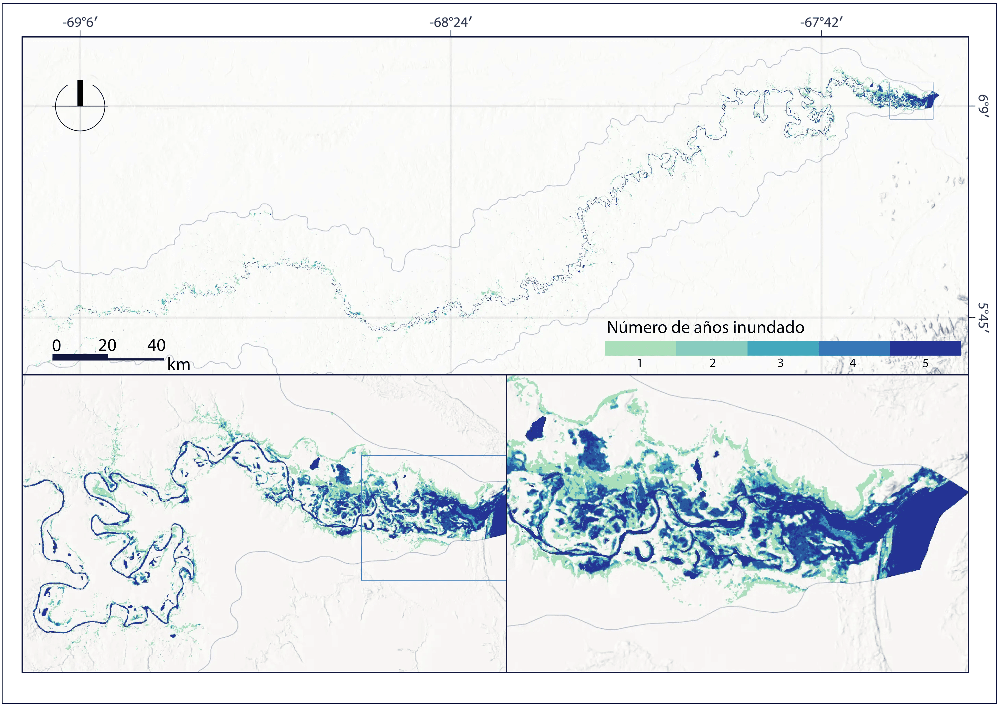
```

A propósito, se obtuvieron las cantidades totales de agua para cada año. Dicha información se puede disgregar en permanente versus agua estacional detectada con SAR. Se obtuvo un rango estable por encima de los 40 km² a través del quinquenio trabajado. Por su parte, el agua producto de inundación o cambio estacional presentó una variabilidad interanual llamativa, con magnitudes que variaron entre los valores máximos de 2018 y los mínimos de 2020.

```{r}
#| label: fig-area-total-jrc-and
#| fig-cap: "Agua total detectada en km² para la cuenca del río Bita para los años 2017-2021. Disgregada en JRC y componente estacional de ratios operados con AND."
#| echo: false
#| out-width: "90%"
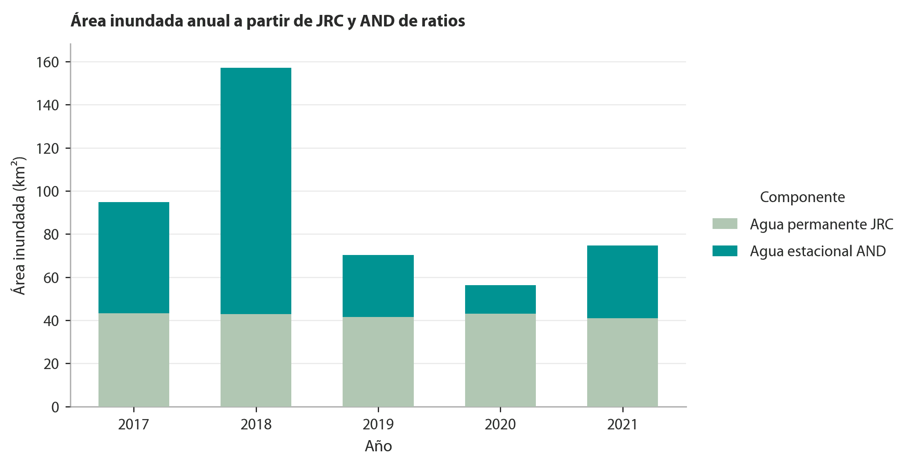
```

Sobre dicho total, se realizó una validación con 300 puntos de control distribuidos en 2018, 2020 y 2021. El desempeño global alcanzó una exactitud de 0.8867, precisión de 0.80, exhaustividad de 0.9677 y F1-score de 0.8759. El bajo número de falsos negativos, 4 casos en total, muestra que el producto omitió pocas áreas clasificadas como inundadas en la referencia. La precisión fue menor por la presencia de 30 falsos positivos, especialmente en 2020, lo que indica cierta tendencia a clasificar como inundadas algunas superficies cuya respuesta SAR correspondía a un cambio, pero no fue asociado a inundación.

```{r}
#| label: tbl-validacion
#| tbl-cap: "Validación del producto final de inundación estacional."
#| echo: false
validacion <- data.frame(
  Año = c("2018", "2020", "2021", "Total"),
  TN = c(47, 50, 49, 146),
  FP = c(7, 17, 6, 30),
  FN = c(3, 0, 1, 4),
  TP = c(43, 33, 44, 120),
  OA = c(0.9000, 0.8300, 0.9300, 0.8867),
  Precision = c(0.8600, 0.6600, 0.8800, 0.8000),
  Recall = c(0.9348, 1.0000, 0.9778, 0.9677),
  F1_score = c(0.8958, 0.7952, 0.9263, 0.8759)
)

knitr::kable(validacion, digits = 4)
```

Por año, el mejor desempeño se obtuvo en 2021, con una exactitud de 0.93 y un F1-score de 0.9263. En 2018 se obtuvo una exactitud de 0.90 y un F1-score de 0.8958, con equilibrio entre falsos positivos y falsos negativos. En 2020 el desempeño disminuyó a una exactitud de 0.83 y un F1-score de 0.7952, debido al aumento de falsos positivos. Sin embargo, ese año presentó exhaustividad de 1.00, lo que indica que todos los puntos de referencia clasificados como inundados fueron detectados por el producto.

El enfoque basado en ratios de retrodispersión estacional es coherente con la naturaleza del fenómeno que se busca capturar: la dinámica hídrica. A diferencia de los métodos de umbral fijo aplicados sobre imágenes individuales, la comparación seco-húmedo aprovecha la variabilidad estacional para detectar cambios en la respuesta SAR, lo que resulta pertinente en sistemas como la cuenca del río Bita. En este sentido, la composición seca como condición de referencia y la composición húmeda como señal de respuesta replican la lógica de detección de cambios documentada por @Li2018, donde el operador ratio es preferido sobre la diferencia simple por su estabilidad frente a la naturaleza multiplicativa del speckle y su capacidad para comparar condiciones radiométricas contrastantes.

A propósito, las diferencias observadas entre los productos R_VV, R_VH, AND y OR son una expresión esperada de las diferencias físicas entre polarizaciones. Que R_VH haya detectado sistemáticamente más área que R_VV a lo largo del periodo 2017-2021 es coherente con el comportamiento reportado por @Tsyganskaya2019a para áreas vegetadas inundadas, pues VH es más sensible a la dispersión volumétrica asociada con la estructura de la vegetación y muestra mayor contraste entre condiciones secas y húmedas en coberturas bajas o herbáceas [@Rosyid2024]. VV, por su parte, responde con mayor intensidad a mecanismos de doble rebote entre láminas de agua y estructuras verticales como tallos emergentes o troncos, por lo que su señal puede incrementar en zonas de vegetación inundada alta, lo que resulta en un contraste estacional más bajo y, por ende, menor área detectada bajo el mismo umbral de ratio [@Bangira2021]. En la cuenca del Bita, dominada por coberturas de sabana, morichales y vegetación riparia [@TrujilloLasso2017], se halla que VH captura una fracción más amplia del paisaje inundado que VV, especialmente en zonas donde la dispersión volumétrica predomina sobre el doble rebote.

De tal manera, la elección del operador AND como aproximación final de la inundación estacional responde a un balance entre comisión y omisión. Dicho operador ofrece una lectura más conservadora que OR, que si bien maximiza la inclusión de áreas detectadas, incorpora respuestas de polarización más ambiguas. Esta disyuntiva está reconocida en la literatura: @Tupas2023a señalan que los métodos más inclusivos tienden a producir mayor tasa de comisión en coberturas heterogéneas. AND reduce esa ambigüedad al exigir consistencia simultánea en ambas polarizaciones y retiene solo los píxeles donde la señal de cambio estacional es representativa independientemente del mecanismo físico dominante.

Cabe mencionar que la interpretación de los productos de radar requiere considerar que la inundación no genera una única firma radiométrica. En superficies de agua abierta o láminas someras relativamente lisas, la señal disminuye durante la temporada húmeda por reflexión especular [@Amitrano2024]. En vegetación inundada, en cambio, la presencia simultánea de agua y estructuras verticales puede incrementar la retrodispersión por doble o múltiple rebote, en particular en VV [@Tsyganskaya2019a]. Esta dualidad es una de las fuentes de falsos positivos identificados en la validación, especialmente en 2020, donde se concentraron buena parte de los casos de comisión del periodo completo. En ese año, áreas con humedad superficial elevada o vegetación con respuesta SAR anómala pudieron haber superado los umbrales de ratio sin corresponder a inundación detectable en la referencia; @Tupas2023b documentan este patrón sistemáticamente en terrenos de baja retrodispersión y vegetación densa.

La incorporación de JRC Global Surface Water respondió a una limitación física estructural del enfoque basado en cambio. Los cuerpos de agua permanentes o recurrentes, al mantener baja retrodispersión tanto en temporada seca como húmeda, no generan el contraste necesario para ser detectados mediante diferencias o ratios [@Pekel2016]. Los resultados ilustran esta complementariedad: el componente JRC se mantuvo relativamente estable durante el quinquenio, mientras que el componente estacional SAR presentó una variabilidad interanual más marcada. La proporción entre ambos tipos de comportamiento hidrológico es ecológicamente coherente con la naturaleza del Bita como sistema de inundación estacional, donde el pulso anual puede movilizar superficies superiores al espejo de agua permanente, tal como describen @JaramilloVilla2015 y @TrujilloLasso2017 para esta cuenca.

Respecto a la variabilidad interanual del componente estacional, se contempla que el máximo de 2018 y el mínimo de 2020 pueden responder a causas concurrentes de distinta naturaleza. Si el pico de inundación se desplazó fuera de la ventana julio-septiembre, el composite húmedo pudo haber subestimado las condiciones de máxima inundación, lo que genera una reducción en el contraste seco-húmedo y, por tanto, el área detectada. Las ventanas estacionales fijas, útiles para garantizar comparabilidad entre años, introducen un sesgo sistemático cuando el ciclo hidrológico se desplaza, como documentan @McCormack2023 para humedales estacionales analizados con series multitemporales Sentinel-1.

En cuanto al desempeño de la validación, los resultados globales (OA = 0.8867, F1 = 0.8759, recall = 0.9677, precisión = 0.80) son favorables y se comparan razonablemente con trabajos análogos en humedales tropicales de sabana. @JeanMilien2026, aplicando Sentinel-1 GRD en el Pantanal, un sistema Ramsar con régimen estacional comparable al del Bita, reportan una asimetría similar entre exhaustividad y exactitud, que se inscribe en la tendencia general de los métodos de radar por cambio a maximizar la detección a costa de mayor comisión. El recall de 0.9677 indica que el producto omitió apenas 4 áreas inundadas de referencia en todo el periodo, lo que es un resultado favorable para un método cuyo objetivo es no subestimar la extensión de inundación. El valor de precisión más bajo (0.80) refleja la presencia de señales SAR ambiguas que el método no puede discriminar sin información auxiliar, una limitación estructural de la banda C documentada por @Adeli2020 en su revisión sistemática de métodos SAR para monitoreo de humedales.

Finalmente, el método presenta limitaciones que conviene precisar. La banda C de Sentinel-1 puede ver su capacidad de penetración reducida en coberturas densas o de dosel cerrado, donde la respuesta del agua bajo la vegetación queda enmascarada [@Hubinger2026]. En formaciones de bosque de galería y morichales del Bita, teóricamente se traduciría en la subestimación del agua bajo cobertura forestal. Los umbrales seleccionados, R_VV = 1.5 y R_VH = 1.3, son parámetros empíricos derivados del análisis de sensibilidad, cuya transferibilidad a otras cuencas o periodos requiere validación específica [@Tupas2023a]. Dicho esto, las extensiones más naturales apuntan en tres direcciones: definir ventanas estacionales de forma dinámica a partir de datos de precipitación o niveles hidrológicos; incorporar variables topográficas como HAND o posición relativa al drenaje para restringir detecciones a zonas geomorfológicamente probables [@Tupas2023b]; y comparar estos resultados con productos ópticos previos para evaluar con mayor detalle las ventajas y limitaciones de cada aproximación.

# Conclusiones

El objetivo general del proyecto se cumplió, pues los cambios estacionales de retrodispersión Sentinel-1 SAR permitieron analizar la dinámica multianual de inundación estacional en la cuenca del río Bita durante el periodo 2017-2021. La comparación seco-húmedo mediante ratios de polarización, implementada en Google Earth Engine, permitió detectar superficies compatibles con inundación estacional de forma consistente a lo largo del periodo de análisis.

En relación con el primer objetivo específico, se construyeron composiciones estacionales de retrodispersión para VV y VH, diferenciando condiciones secas y húmedas en cada año. Esta decisión permitió representar la variabilidad temporal del fenómeno sin depender de una única imagen, y redujo parte de la variabilidad puntual asociada a condiciones específicas de adquisición.

Respecto al segundo objetivo, el cálculo de ratios seco-húmedo permitió evaluar la respuesta diferencial de las polarizaciones VV y VH. La combinación de umbrales R_VV = 1.5 y R_VH = 1.3, junto con la comparación entre operadores AND y OR, mostró que las decisiones lógicas modifican de manera sustancial la extensión detectada. La elección de AND como producto final resultó metodológicamente justificada, pues al exigir simultáneamente umbrales de ratio en VV y VH redujo la ambigüedad radiométrica propia de coberturas heterogéneas.

Frente al tercer objetivo, la integración con JRC Global Surface Water permitió complementar la fracción estacional con el componente permanente de agua superficial. Esto tuvo como resultado un producto final que captura dos dimensiones distintas de la dinámica hídrica del sistema: por un lado, las áreas con señal estacional de cambio detectada por SAR; por otro, los cuerpos de agua persistentes que pueden no generar contraste suficiente entre temporadas.

En cuanto al cuarto objetivo, la validación temática mostró un desempeño favorable del producto final, con una exactitud global de 0.8867, F1-score de 0.8759 y exhaustividad de 0.9677. Estos valores indican baja omisión de áreas inundadas, aunque con presencia de falsos positivos asociados a respuestas SAR ambiguas, especialmente en 2020. Esta comisión no invalida el producto, pero sí evidencia que la señal SAR puede responder a condiciones de humedad, vegetación o cambios superficiales que no siempre equivalen a inundación observable en la referencia.

La variabilidad interanual observada, con un máximo en 2018 y un mínimo en 2020, refleja tanto condiciones hidrológicas reales como limitaciones metodológicas asociadas a ventanas estacionales fijas que pueden no coincidir con el pico de inundación en todos los años. A pesar de estas limitaciones, el flujo desarrollado permitió representar espacialmente la dinámica de inundación estacional del Bita y generar productos cartográficos reproducibles bajo un enfoque de ciencia abierta.

# Disponibilidad de datos y código

Los scripts de Google Earth Engine utilizados en este estudio se encuentran disponibles públicamente en el repositorio del proyecto. El repositorio incluye el código necesario para la generación de composiciones estacionales, cálculo de ratios, evaluación de umbrales, integración con JRC Global Surface Water, mapeo multianual y exportación de estadísticas espaciales.

# Referencias
